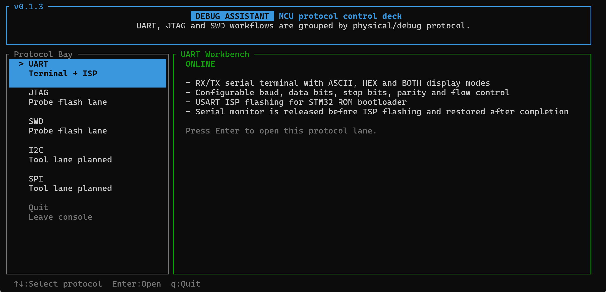

# Debug Assistant

基于终端的串口调试与 STM32 固件下载工具，使用 Rust 编写。

启动后进入主菜单，按方向键选择工具，按 `Enter` 进入：



| 工具 | 用途 |
|------|------|
| **Serial Monitor** | 串口调试终端 |
| **STM32 Flasher** | STM32 固件下载 |

---

## 功能概览

- 串口调试：手动连接和断开串口，查看设备输出并发送数据
- 多种显示方式：支持 ASCII、HEX、双栏显示
- 发送辅助：支持发送历史、换行后缀、HEX 发送模式
- STM32 下载：支持串口下载和 JTAG/SWD 下载
- 固件格式：支持 `.bin` 和 `.hex`
- 下载反馈：显示操作日志、进度和结果状态

---

## Serial Monitor

用于串口调试和日常通信测试，支持：

- 手动选择串口参数并连接
- 手动断开串口连接
- 查看设备输出
- 发送文本数据或 HEX 数据
- 切换显示模式（ASCII / HEX / BOTH）
- 查看带时间戳的收发日志
- 查看发送和接收字节统计
- 滚动查看历史数据

如果串口通信过程中出现异常，程序会自动断开并给出状态提示。

---

## STM32 Flasher

用于 STM32 固件下载，支持两种方式：

### USART ISP（串口下载）

- 选择串口和固件文件后即可开始下载
- 支持 `.bin` / `.hex` 固件
- 支持手动和自动两种进入下载模式的方式
- 下载过程中显示操作日志和进度
- 下载完成后自动结束下载会话并启动程序
- 如果串口调试模块正在占用同一个端口，程序会自动处理端口切换，并在下载结束后恢复串口调试连接

### JTAG / SWD（调试探针下载）

- 选择调试探针后即可下载固件
- 支持 `.bin` / `.hex` 固件
- 需要输入目标芯片名称
- 下载过程中显示操作日志和进度

---

## 构建

需要安装 Rust 稳定版工具链与 Cargo：

```bash
cargo build --release
```

Windows 下生成的可执行文件位于：

- `target/release/debug-assistant.exe`

---

## 运行

开发运行：

```bash
cargo run --release
```

也可以先构建，再直接运行：

- `target/release/debug-assistant.exe`

---

## 使用

启动后进入 Home 主菜单：

1. `↑ / ↓` 选择工具
2. `Enter` 进入

### Serial Monitor 快捷键

#### 全局

| 按键 | 功能 |
|------|------|
| F1 | 打开帮助（任意键关闭） |
| F2 | 打开串口配置 |
| F3 | 清除接收日志 |
| F4 | 切换显示模式（ASCII → HEX → BOTH） |
| F5 | 切换自动滚动 |
| Tab | 切换焦点（接收 ↔ 发送） |
| Ctrl+D | 断开连接 |
| Ctrl+C / q | 退出 |
| Esc | 返回主菜单 |

#### 发送面板

| 按键 | 功能 |
|------|------|
| Enter | 发送 |
| ↑ / ↓ | 浏览发送历史 |
| ← / → | 移动光标 |
| Home / End | 跳至行首 / 行尾 |
| Backspace / Delete | 删除字符 |
| Ctrl+H | 切换 HEX 发送模式 |
| Ctrl+N | 切换换行后缀（None → CR → LF → CRLF） |

#### 接收面板

| 按键 | 功能 |
|------|------|
| ↑ / ↓ | 滚动一行 |
| PgUp / PgDn | 滚动一页 |
| Home / End | 跳至顶部 / 底部 |

#### 配置弹窗

| 按键 | 功能 |
|------|------|
| ↓ / Tab | 下一个配置项 |
| ↑ / Shift+Tab | 上一个配置项 |
| ← / → | 修改当前值 |
| Enter | 应用配置并连接 |
| Esc | 取消 |

### STM32 Flasher 快捷键

#### 方法选择

| 按键 | 功能 |
|------|------|
| ↑ / ↓ | 选择下载方式 |
| Enter | 进入配置 |
| Esc | 返回主菜单 |

#### USART ISP 配置界面

| 按键 | 功能 |
|------|------|
| ↓ / Tab | 下一个配置项 |
| ↑ / Shift+Tab | 上一个配置项 |
| ← / → | 修改端口、波特率和下载模式等选项 |
| Backspace | 删除文件路径字符 |
| Enter | 开始下载 |
| Esc | 返回方法选择 |

#### JTAG / SWD 配置界面

| 按键 | 功能 |
|------|------|
| ↓ / Tab | 下一个配置项 |
| ↑ / Shift+Tab | 上一个配置项 |
| ← / → | 切换调试探针 |
| Backspace | 删除芯片名或文件路径字符 |
| Enter | 开始下载 |
| Esc | 返回方法选择 |

#### 下载进度界面

| 按键 | 功能 |
|------|------|
| ↑ / ↓ | 滚动日志 |
| Esc | 请求取消当前操作并返回配置界面 |
| q | 退出程序 |

---

## 依赖

| 库 | 用途 |
|----|------|
| [ratatui](https://github.com/ratatui/ratatui) | TUI 框架 |
| [crossterm](https://github.com/crossterm-rs/crossterm) | 终端控制 |
| [serialport](https://github.com/serialport/serialport-rs) | 串口读写 |
| [chrono](https://github.com/chronotope/chrono) | 时间戳 |
| [unicode-width](https://github.com/unicode-rs/unicode-width) | 中文宽字符光标定位 |
| [anyhow](https://github.com/dtolnay/anyhow) | 错误处理 |
| [tui-big-text](https://github.com/joshka/tui-big-text) | 大号标题文字 |
| [probe-rs](https://github.com/probe-rs/probe-rs) | 调试探针通信 |
| [ihex](https://github.com/mciantyre/ihex) | HEX 文件解析 |

---

## 许可证

MIT
