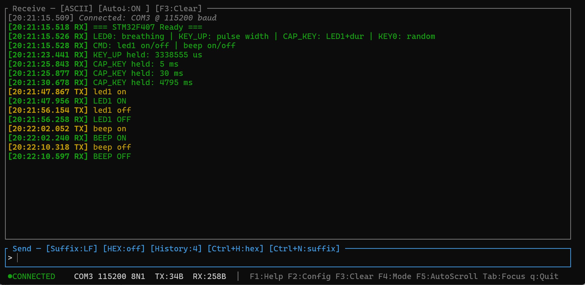

# Serial Debug Assistant

基于终端的串口调试工具，使用 Rust 编写。

## 功能

- 串口参数配置：端口、波特率、数据位、停止位、校验位、流控
- 接收显示：ASCII / HEX / 双栏（HEX + ASCII）三种模式，带毫秒时间戳
- 中英文正确显示，无效字节以 `\xNN` 标注
- 行缓冲接收：按换行符聚合，100 ms 超时自动刷新
- 发送：支持发送历史（↑/↓），可追加换行后缀（None / CR / LF / CRLF）
- HEX 发送模式：输入 `48 65 6C 6C 6F` 直接发送字节
- 滚动日志，自动跟随，TX/RX 字节计数

## 界面



## 构建

需要 Rust 工具链（1.75+）：

```bash
cargo build --release
```

产物位于 `target/release/debug-assistant`（Windows 为 `.exe`）。

## 发布

当前版本号来自 `Cargo.toml`，例如当前版本为 `0.1.0`。

发布文件统一放在项目根目录下的 `release` 目录中：

`release/debug-assistant-v0.1.0/`

目录内当前包含以下文件：

- `debug-assistant-v0.1.0-release.exe`

说明：

- `release` 版本用于正式发布，性能和体积更适合日常使用

## 使用

```bash
cargo run --release
```

启动后按 **F2** 打开配置弹窗，选择串口和参数，按 **Enter** 连接。

## 快捷键

### 全局

| 按键 | 功能 |
|------|------|
| F1 | 打开帮助（任意键关闭） |
| F2 | 串口配置 / 连接 |
| F3 | 清除接收日志 |
| F4 | 切换显示模式（ASCII → HEX → BOTH） |
| F5 | 切换自动滚动 |
| Tab | 切换焦点（接收 ↔ 发送） |
| Ctrl+D | 断开连接 |
| Ctrl+C / q | 退出 |

### 发送面板

| 按键 | 功能 |
|------|------|
| Enter | 发送 |
| ↑ / ↓ | 浏览发送历史 |
| ← / → | 移动光标 |
| Home / End | 跳至行首 / 行尾 |
| Backspace / Delete | 删除字符 |
| Ctrl+H | 切换 HEX 发送模式 |
| Ctrl+N | 切换换行后缀（None → CR → LF → CRLF） |

### 接收面板

| 按键 | 功能 |
|------|------|
| ↑ / ↓ | 滚动一行 |
| PgUp / PgDn | 滚动一页 |
| Home / End | 跳至顶部 / 底部 |

### 配置弹窗

| 按键 | 功能 |
|------|------|
| ↑ / ↓ / Tab | 切换配置项 |
| Shift+Tab | 上一个配置项 |
| ← / → | 修改当前值 |
| Enter | 应用并连接 |
| Esc | 取消 |

## 依赖

| 库 | 用途 |
|----|------|
| [ratatui](https://github.com/ratatui/ratatui) | TUI 框架 |
| [crossterm](https://github.com/crossterm-rs/crossterm) | 终端控制 |
| [serialport](https://github.com/serialport/serialport-rs) | 串口读写 |
| [chrono](https://github.com/chronotope/chrono) | 时间戳 |
| [unicode-width](https://github.com/unicode-rs/unicode-width) | 中文宽字符光标定位 |
| [anyhow](https://github.com/dtolnay/anyhow) | 错误处理 |

## 许可证

MIT
